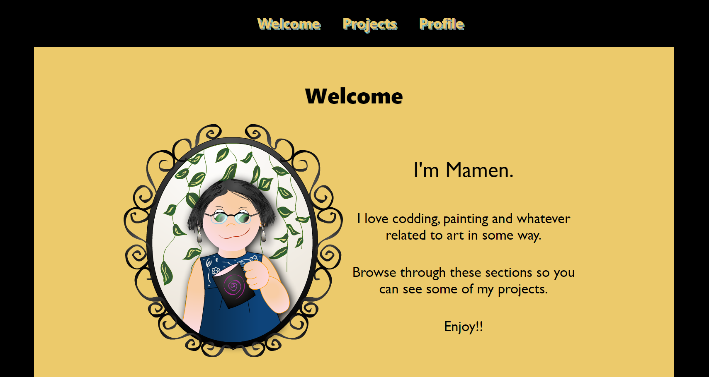

# Portfolio
This portfolio started as a project for FreeCodeCamp, but now it's my imaginary portfolio. A portfolio devoted to the imagination 
<h2>Portfolio</h2>

  

<h2>My files</h2>
Here you can find all my files.
<a href="https://github.com/Amapola-Negra/MAMEN-COLLECTION-REPO">See my files</a>
